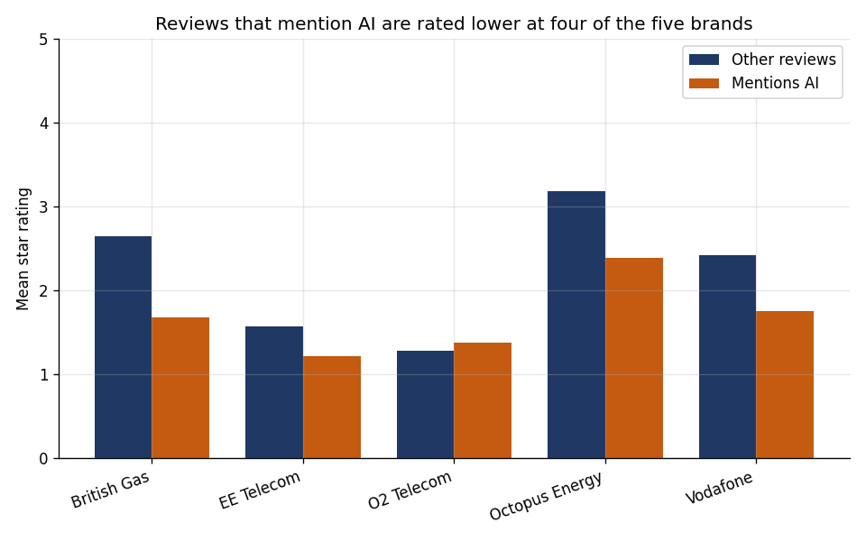
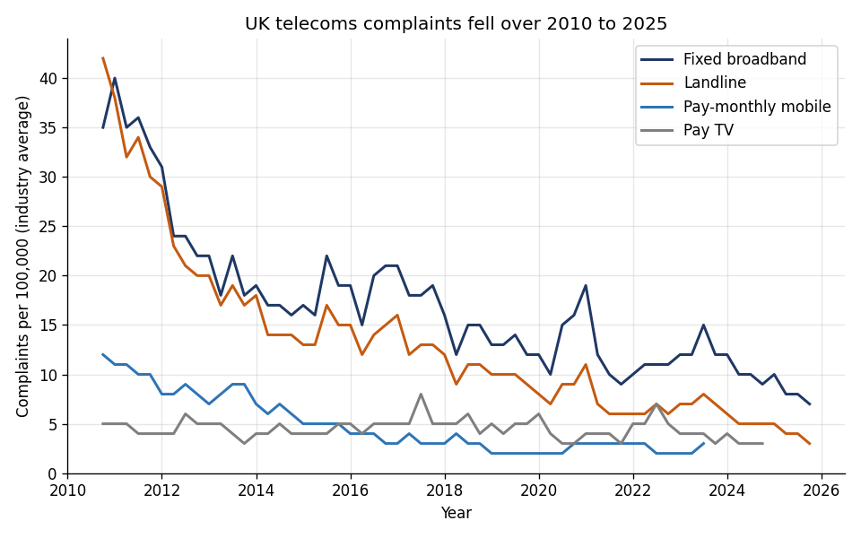
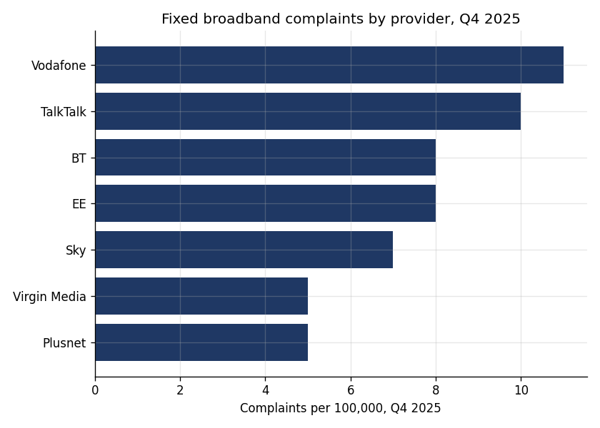
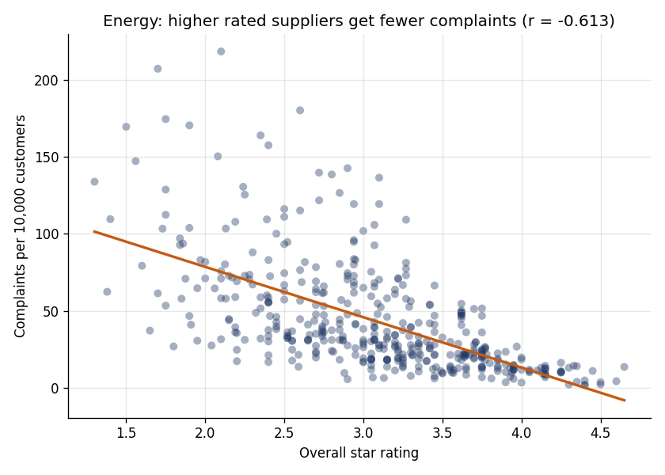

% AI Customer Service and Consumer Outcomes in UK Telecoms and Utilities
% Oluwapelumi Alagbe
% July 2026

## Summary

Firms in UK telecoms and utilities are moving customer contact to AI. I ask what
that does to consumer outcomes, using three real sources: 2,000 app
store reviews for five large telecom and energy brands, each flagged for whether it
mentions AI; Ofcom complaints per 100,000 customers for telecoms from 2010 to 2025;
and the Citizens Advice energy supplier ratings panel.

Three findings stand out. Reviews that mention AI are rated much lower than other
reviews, 1.624 against 2.219 stars, and the gap
survives brand and year controls (-0.624 stars, p < 0.001). At the
same time, aggregate telecoms complaints fell over the period, with fixed broadband
complaints dropping from 35 to 7
per 100,000, so this is not a story of collapsing service. In energy, dissatisfaction
is coherent, with higher rated suppliers receiving far fewer complaints
(r = -0.613), though call wait time alone does not predict
complaints once supplier differences are accounted for (p = 0.69). Together these
point to a specific tension: overall service has improved, yet the AI channel itself
draws worse ratings, which is what a regulator of essential services would want to
watch.

## Data

* App store reviews for Vodafone, O2, EE, British Gas and Octopus Energy, collected
  by the author, with a star rating and a flag for whether the text mentions AI or
  bots.
* Ofcom Telecoms and Pay TV complaints, complaints per 100,000 customers by provider
  and service, quarterly from 2010 to 2025.
* Citizens Advice energy supplier ratings, a supplier by quarter panel of overall
  rating, call wait time, email response rate and complaints per 10,000 customers.

## Where AI service shows up in reviews

The gap is not a quirk of one brand or one year. In a regression of the star rating
on the AI flag with brand and year controls, mentioning AI is associated with
-0.624 of a star (p < 0.001).

## The wider trend in telecoms

Regulated complaint rates fell steadily over the period, so the negative AI signal
in reviews sits against a background of improving aggregate service, not a collapse.

## Consumer outcomes in energy

Ratings and complaints line up (r = -0.613), which says the
outcome measures are capturing real dissatisfaction. Call wait time on its own does
not predict complaints within suppliers, so how contact is handled, including by AI,
plausibly matters beyond simple speed.

## Limitations

Reviews are self selected and skew negative, and a review that mentions AI is more
likely written by someone who had a bad AI experience, so this measures the
experience people choose to report rather than the average interaction. The flag
marks whether a review mentions AI, not whether the firm used AI in that
interaction. I do not observe when each firm deployed AI service, so I cannot
attribute the complaint trend to AI. Retention and switching are not directly
observed; complaints and ratings are proxies for dissatisfaction. These are
associations, not causal effects.

## Policy relevance

AI in essential services is a consumer protection question for Ofcom and Ofgem. The
measures used here are cheap to compute and could be tracked as an early indicator
of whether AI mediated service is helping or harming consumers, before it shows up
in complaints or switching.

## References

- Ofcom, Telecoms and Pay TV Complaints, quarterly editions.
- Citizens Advice, Energy supplier performance and star ratings.
- App store reviews collected by the author.
